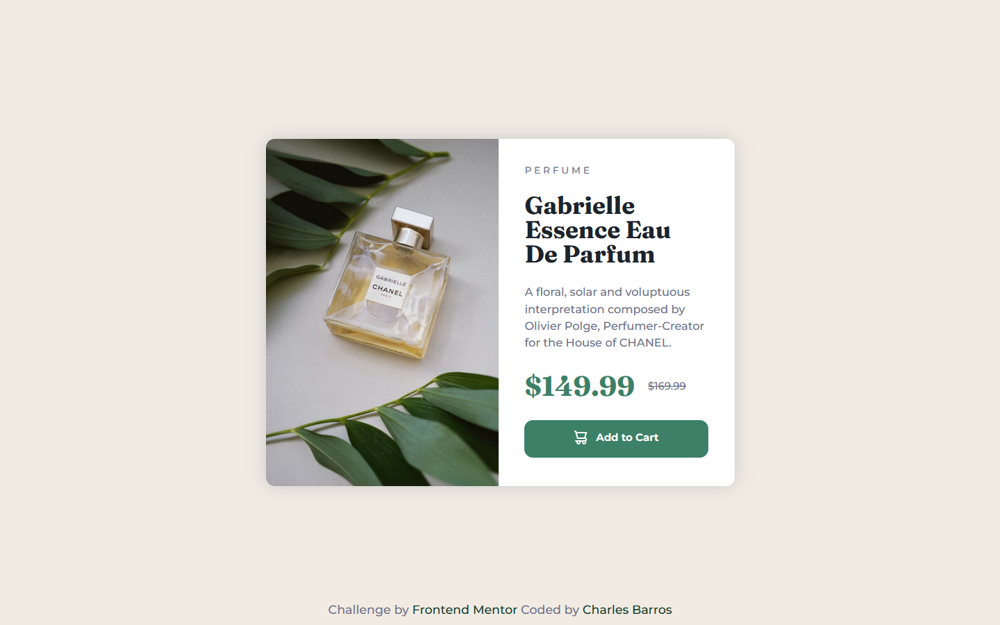

# Product Card Challenge | Frontend Mentor | Charles Barros

## Table of contents

- [Overview](#overview)
  - [The challenge](#the-challenge)
  - [Screenshot](#screenshot)
  - [Links](#links)
- [My process](#my-process)
  - [Built with](#built-with)
  - [What I learned](#what-i-learned)
  - [Continued development](#continued-development)
  - [Useful resources](#useful-resources)
- [Author](#author)
- [Acknowledgments](#acknowledgments)

## Overview

### The challenge
This is my proposal of solution to the Product Card Challenge on Frontend Mentor website and was my third non-tutorial project in frontend carrer. As the two first, this challenge consists of creating a simple static page using the jpg design file as reference and implementing only HTML5 and CSS3, but in this challenge I had to use new responsiveness concepts such as Media Query in CSS, because the Challenge's Style Guide asked me for two different layouts, one to Desktop and other to Mobile.

### Screenshot

### Links

- [Live Solution at Versel](https://product-card-challenge-tau.vercel.app/)
- [Solution on Frontend Mentor](https://www.frontendmentor.io/solutions/responsive-product-card-sass-css3-and-html5-BrHyGpZlta)
- [Code on Github](https://github.com/charbavito/Product_Card_Challenge#)

## My process

### Built with
I started by configuring the project folder and initializing the version control sistem. Then I structured all the content senatically in HTML and started configuring the styles through SASS pre-processor for the Desktop version. After finalizing the entire content and layout of Desktop version I started the Mobile layout using Media Query. Finally I proceeded to finalize the interactions using CSS hover pseudo-classes and editing the Readme file.

### What I learned
Again a project with great learning, where I was able to apply and strengthen all the knowledge acquired with the previous challenges and add new important knowledge about SASS pre-processor, use of partials and responsivness with Media Queries.

### Continued development
I intend to continue carrying out the challenges of the Frontend Mentor platform, especially those initial ones that only require HTML and CSS and strengthen my foundations in these languages, while I'm still learning the initial concepts of JavaScript.

### Useful resources
I used the W3School website a lot to query various CSS properties to achieve the result I needed
- [W3School References](https://www.w3schools.com/cssref/default.asp) - References to CSS Properties

## Author

- Linkedin - [Charles Barros](https://www.linkedin.com/in/charles-barros/)
- Frontend Mentor - [@charbavito](https://www.frontendmentor.io/profile/charbavito)
- Github - [Charles (charbavito) Barros](https://github.com/charbavito)

## Acknowledgments

I thank the entire Frontend Mentor team for making this platform available with such useful and important content for those who are starting to venture into this Web Developer career. Thank you very much (again) :)